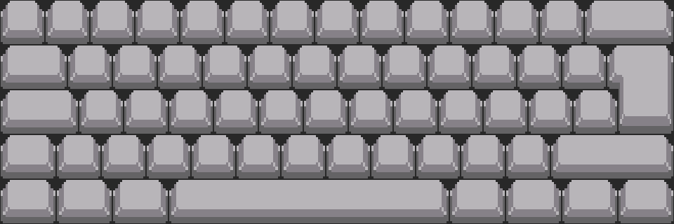
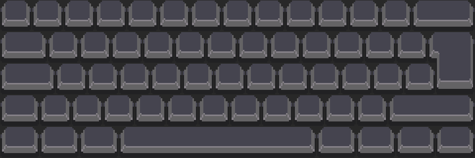

### custom-keycap-asset example

This example shows how to use png file of 1u (64x64 px) and iso enter
(96x128 px) keycaps for keyboard theme.
The source assets downloaded from [1]. In order to fit `klawa` requirements
they were resized and joined into `jumbo_[variant].png` files.

| light                             | dark                              |
| ---                               | --                                |
|  |  |

```
theme = custom_from_keycap
# try also jumbo_dark.png, jumbo_light.png or jumbo_light_with_gap.pn
theme_custom_atlas_path = jumbo_dark_with_gap.png
layout_preset = 60_iso
```

> [!NOTE] If using layout without ISO enter key, then preparation of ISO enter
> texture can be skipped but file set with `theme_custom_atlas_path` must
> have expected dimensions of 160x128 px

[1] https://beamedeighth.itch.io/simplekeys-animated-pixel-keyboard-keys
