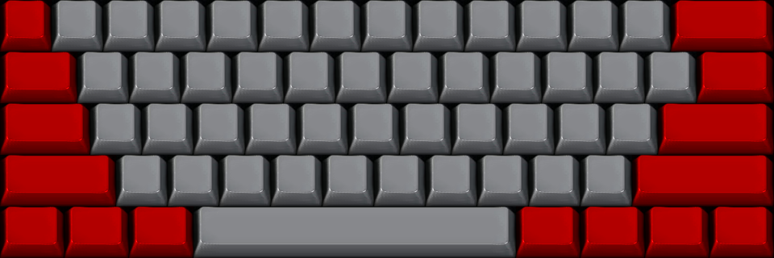

### customized-pok3r-theme example

This example is created by using `save-atlas` option with builtin `vortex_pok3r` theme.
Saved atlas is then customized (coloured) and used directly with explicit atlas mapping.



```
theme = custom
theme_custom_atlas_path = atlas.png
theme_custom_atlas_map = 0   0,  64   0, 128   0, 192   0, 256   0, 320   0, 384   0, 448   0, 512   0, 576   0, 640   0, 704   0, 768   0, 832  0,
                         0  64,  96  64, 160  64, 224  64, 288  64, 352  64, 416  64, 480  64, 544  64, 608  64, 672  64, 736  64, 800  64, 864 64,
                         0 128, 112 128, 176 128, 240 128, 304 128, 368 128, 432 128, 496 128, 560 128, 624 128, 688 128, 752 128, 816 128,
                         0 192, 144 192, 208 192, 272 192, 336 192, 400 192, 464 192, 528 192, 592 192, 656 192, 720 192, 784 192,
                         0 256,  80 256, 160 256, 240 256, 640 256, 720 256, 800 256, 880 256,
layout_preset = 60_ansi
```
